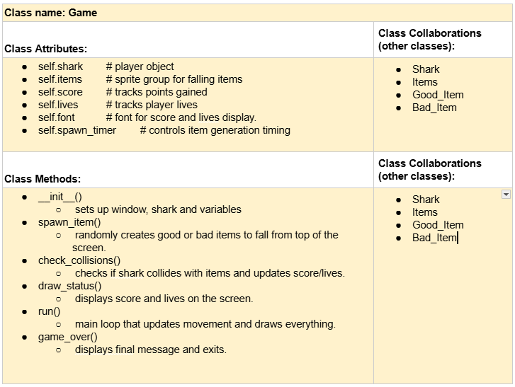
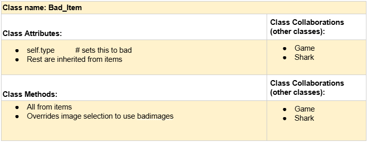
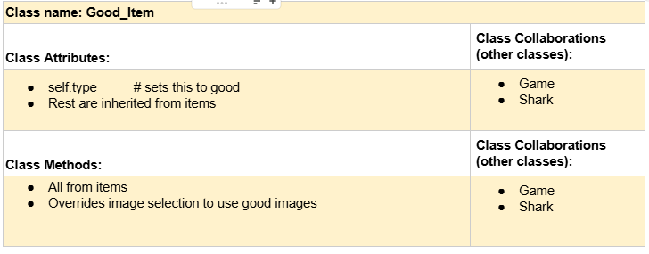
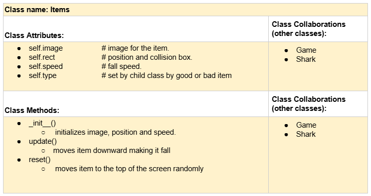
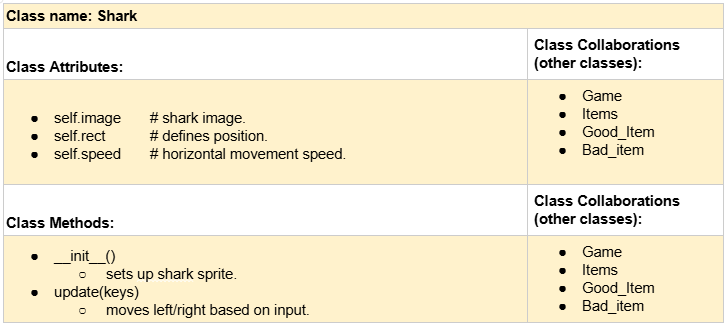

# CSC226 Final Project

## Instructions

❗️Exclamation Marks ❗️indicate action items; you should remove these emoji as you complete/update the items which 
  they accompany. (This means that your final README should have no ❗️in it!)

Author(s): Amna Ali

Google Doc Link: https://docs.google.com/document/d/1exCCpoyNlmkfvNWsoOh0qh2_4I6DcWhGPj0PTBDN7mw/edit?usp=sharing

---

## Milestone 1: Setup, Planning, Design

**Title**: Feeding Frenzy

**Purpose**: This project is a small game where a shark moves left and right at the bottom of the screen to eat 
             good falling items like fish or shells and avoid bad items like trash or oil. The player earns points for 
             eating good things and loses lives for eating bad things.

**Source Assignment(s)**:   HW04: A Bug's Life
                            HW05: Funky Functions
                            HW08: It's in your Genes
                            T11:  The legend of Tuna: Breath of Catnip
                            T10: Intro to Classes


**CRC Card(s)**:












**Branches**: This project will **require** effective use of git. 
 

```
    Branch 1 starting name: alia2
```

### References 

Throughout this project, you will likely use outside resources. Reference all ideas which are not your own, 
and describe how you integrated the ideas or code into your program. This includes online sources, people who have 
helped you, AI tools you've used, and any other resources that are not solely your own contribution. Update this 
section as you go. DO NOT forget about it!

Pygame Documentation: https://www.pygame.org/docs/
- Used to learn sprite setup, event handling, font rendering and collision detection.

itch.io Free Game Assets (Pixel Art section) : https://itch.io/game-assets/tag-pixel-art
- Source of pixel art sprites, backgrounds and animation sets. 
- Used to find pixel sharks, fish and undersea items under open licenses.

Graphics for lives: https://nicolemariet.itch.io/pixel-heart-animation-32x32-16x16-freebie
- using the gif for hearts

Sprite for Rusty Can: https://pixelgnome.itch.io/fish
- Sprite for my bad item

Sprite for Fish: https://snowdingo.itch.io/pixel-fishes
- Sprite for my goof item

Sprite for water: https://ninjikin.itch.io/water/comments
- Used a sprite to make a loop of a GIF

Sprite for start button: https://www.pngwing.com/en/free-png-yearn
- Using for an interactive start button

Sprite for Life: https://miguel-pm-romeu.itch.io/heart

Sprite Database (Pixel-Style Sprites): https://spritedatabase.net/
- Reference for retro sprite designs and pixel character inspiration

Font: https://www.1001fonts.com/pixel-fonts.html
- Pixel font used in game

CSC 226 Assignment T11
- Served as a model for inheritance and object oriented coding.

ChatGPT (GPT-5)
- Helped with inheritance logic and other cofusions.

Class Lecture Notes
- Used for concepts of eventdriven programming and class inheritance.


---

## Milestone 2: Code Setup and Issue Queue

Most importantly, keep your issue queue up to date, and focus on your code. 🙃

Reflect on what you’ve done so far. How’s it going? Are you feeling behind/ahead? What are you worried about? 
What has surprised you so far? Describe your general feelings. Be honest with yourself; this section is for you, not me.

```
    I feel like I am at a good spot. my coding started off really well and I have all the essentials down. I have
    made the classes and I have started with piecing everything together. I think it is a good start. I feel confident
    in the direction I have taken. I am however scared to start coding all the interactions and dealing with all 
    the "what ifs" because it can go wrong and there is so much to think about. I hope that I am able to break it all 
    down and slwoly deal with each and every possibility
```

---

## Milestone 3: Virtual Check-In

❗Indicate what percentage of the project you have left to complete and how confident you feel. 

❗️**Completion Percentage**: `0 - 100%`

❗️**Confidence**: Describe how confident you feel about completing this project, and why. Then, describe some 
  strategies you can employ to increase the likelihood that you'll be successful in completing this project 
  before the deadline.

```
    **Replace this with your reflection
```

---

## Milestone 4: Final Code, Presentation, Demo

### ❗User Instructions

❗In a paragraph, explain how to use your program. Assume the user is starting just after they hit the "Run" button 
in PyCharm. 

### ❗Errors and Constraints

❗Every program has bugs or features that had to be scrapped for time. These bugs should be tracked in the issue queue. 
You should already have a few items in here from the prior weeks. Create a new issue for any undocumented errors and 
deficiencies that remain in your code. Bugs found that aren't acknowledged in the queue will be penalized.

### ❗Reflection

❗Each partner should write three to four well-written paragraphs address the following (at a minimum):
- Why did you select the project that you did?
- How closely did your final project reflect your initial design?
- What did you learn from this process?
- What was the hardest part of the final project?
- What would you do differently next time, knowing what you know now?
- How well did you work with your partner? What made it go well? What made it challenging?

```
    Partner 1: **Replace this with your reflection
```

```
    Partner 2: **Replace this with your reflection
```

---